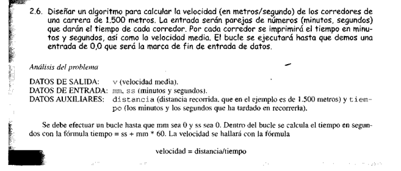

<!DOCTYPE html>
<html lang="en">
<head>
    <meta charset="UTF-8">
    <meta name="viewport" content="width=device-width, initial-scale=1.0">
    <title>Document</title>
    <link rel="stylesheet" href="../Recuperaccion/Bootstrap/css/bootstrap.min.css">
</head>
<body>
    <nav class="navbar navbar-expand-lg bg-body-tertiary">
        

          <a class="navbar-brand" href="Index.html">Recuperacion</a>
          <button class="navbar-toggler" type="button" data-bs-toggle="collapse" data-bs-target="#navbarText" aria-controls="navbarText" aria-expanded="false" aria-label="Toggle navigation">
            
          </button>
          

            <ul class="navbar-nav me-auto mb-2 mb-lg-0">
              <li class="nav-item">
                <a class="nav-link active" aria-current="page" href="Ejemplo2-4.html">Ejemplo2.4</a>
              </li>
              <li class="nav-item">
                <a class="nav-link" href="Ejemplo2-5.html">Ejemplo2.5</a>
              </li>
              <li class="nav-item">
                <a class="nav-link" href="Ejemplo2-6.html">Ejemplo2.6</a>
              </li>
              <li class="nav-item">
                <a class="nav-link" href="Ejemplo2-10.html">Ejemplo2.10</a>
              </li>
              <li class="nav-item">
                <a class="nav-link" href="Ejemplo210.html">Ejemplo2.10</a>
              </li>
            </ul>
          

        

      </nav>
      <h2 style="text-align: center;"> Recuperacion 2do Parcial </h2>
      <h3 style="text-align: center;">Vicente Luis Pérez IC-32M</h3>
      <h3 style="text-align: center;"> Impar </h3>
      

        

          

            
          

          

            
          

        

        

          

            
          

          

            
          

          

            
          

        

      

</body>
</html>
